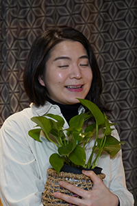

## 저는요

프론트엔드 개발자 **이왜지** (본명 이예지)라고 합니다.
미술을 공부했고, 형태를 불문하고 만드는 것을 좋아합니다.
웹 언어를 사용해서 사람에게 유용한, 세상에 이로운 것들을 만들고 싶습니다.

서울에 거주하고, 상시 공부 중입니다.

혹시 **[ 비영리, 환경, 자연 ]** 관련 프로젝트를 진행하고 계시다면,
프론트 쪽으로 참여 의향이 있으니 언제든지 이메일로 문의주시기 바랍니다.

whyejilee@gmail.com

Hi, my name is Yeji Lee, and I'm a frontend developer.
(Weiji roughly means 'why is it?' in Korean... but I hear it can also mean 'crisis' in Chinese.)
I studied art, and I've always enjoyed making and building, regardless of the medium.
I want to use web technology to build things that are useful for people and beneficial for the world.

Based in Seoul, always in learning mode.

If you're pursuing a **[ non-profit, environment, nature ]** related project,
I'm looking for a frontend project to participate in, hit me up with an email!